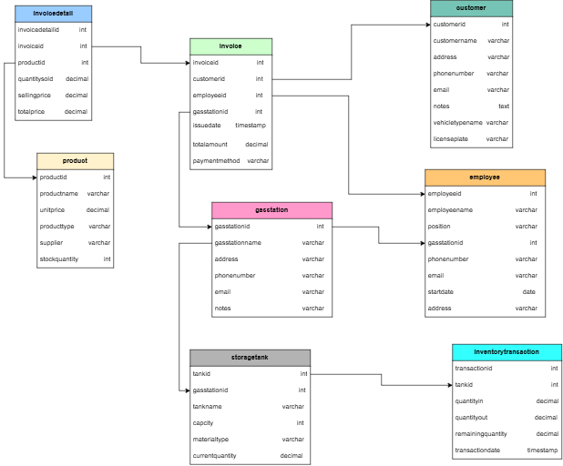

# GasStationDB - Data Warehouse & Business Intelligence Project
> **Repository:** Gasstation_KRK  
> **Group:** Project Group 1

โครงงานออกแบบและพัฒนาคลังข้อมูล (Data Warehouse) จากระบบ OLTP สู่ OLAP สำหรับธุรกิจปั๊มน้ำมัน (GasStationDB) เพื่อตอบคำถามทางธุรกิจและสร้าง Interactive Dashboard

---

## สมาชิกในกลุ่ม 

| รหัสนักศึกษา | ชื่อ-นามสกุล | บทบาทหน้าที่ |
| :---: | :--- | :--- |
| 673020045-9 | นายประภากร มีใส | |
| 673020244-3 | นายกิตติพัศ ลาล้ำ |  |
| 673020256-6 | นางสาวปภาวดี เหมาะดี |  |
| 673020264-7 | นางสาวสุกัญญา อุดมกัน |  |
| 673020266-3 | นางสาวสุพิชญา ผ่องสนาม |  |
| 673020270-2 | นางสาวอาทิติญา ชาชัย |  |

---

## 1.Operational Database (OLTP)

* **ชุดข้อมูลต้นทาง:** GasStationDB (HCM City - PostgreSQL) จาก Kaggle
* **บริบทของระบบ:** ระบบบันทึกธุรกรรมการขายน้ำมันประจำวัน การจัดการคลังน้ำมัน หัวจ่าย พนักงาน และลูกค้า
* **ER Diagram ต้นทาง:**

---

## 2.Business Questions (15 ข้อ)

### ด้านยอดขายและรายได้ (`invoice`, `invoicedetail`)

1. รายได้รวม (`totalamount`) แยกตามสาขา (`gasstationid`) ในแต่ละเดือนเป็นเท่าไหร่?

2. สินค้า/น้ำมันชนิดใด (`productid`) ขายดีที่สุดเมื่อวัดจาก `quantitysold` และ `totalprice`?

3. ช่องทางการชำระเงิน (`paymentmethod`) แบบไหนที่ลูกค้าใช้มากที่สุด และสัดส่วนเป็นอย่างไร?

4. ใบแจ้งหนี้เฉลี่ยต่อบิล (`totalamount` เฉลี่ยต่อ `invoiceid`) อยู่ที่เท่าไหร่ และมีแนวโน้มเพิ่ม/ลดหรือไม่?

 

### ด้านลูกค้า (`customer`)

5. ลูกค้ารายใดซื้อบ่อยที่สุด/มีมูลค่าซื้อสะสมสูงสุด (จาก `customerid` เชื่อมกับ `invoice`)

6. ประเภทยานพาหนะ (`vehicletypename`) แบบไหนที่มาเติมน้ำมันมากที่สุด?

7. มีลูกค้าที่ไม่ได้กลับมาซื้อซ้ำในช่วง 3-6 เดือนที่ผ่านมาจำนวนเท่าไหร่ (Customer Churn)?

 

### ด้านพนักงาน (`employee`)

8. พนักงานคนใด (`employeeid`) ปิดยอดขาย (`totalamount`) ได้สูงสุดในแต่ละเดือน?

9. แต่ละสาขามีจำนวนพนักงาน (`position`) เพียงพอต่อปริมาณธุรกรรม (`invoice`) หรือไม่?

 

### ด้านสต๊อกและถังเก็บน้ำมัน (`product`, `storagetank`, `inventorytransaction`)

10. ปริมาณน้ำมันคงเหลือ (`currentquantity`) ในแต่ละถัง (`tankid`) ใกล้ถึงจุดต่ำสุดที่ต้องสั่งเติมหรือยัง?

11. อัตราการหมุนของสต๊อก (`stockquantity` เทียบกับ `quantitysold`) ของสินค้าแต่ละชนิดเป็นอย่างไร?

12. ปริมาณน้ำมันเข้า (`quantityin`) vs ออก (`quantityout`) ในแต่ละถัง สอดคล้องกับยอดขายจริงหรือไม่ (ตรวจสอบการรั่วไหล/สูญหาย)?

13. ซัพพลายเออร์ (`supplier`) รายใดที่ส่งสินค้าให้บ่อยที่สุด และราคาต้นทุน (`unitprice`) เทียบกับ `sellingprice` ให้มาร์จิ้นเท่าไหร่?

 

### ด้านสาขา/ภาพรวมธุรกิจ (`gasstation`)

14. สาขา (`gasstationid`) ใดทำรายได้สูงสุด/ต่ำสุด เมื่อเทียบกันในแต่ละช่วงเวลา?

15. ความจุถังเก็บ (`capacity`) ของแต่ละสาขาเพียงพอต่อยอดขายเฉลี่ยต่อวันหรือไม่ (วิเคราะห์ความเสี่ยงน้ำมันหมด)?

---

## 3. Multidimensional Data Model Design

การออกแบบคลังข้อมูลในรูปแบบ **Star Schema** ประกอบด้วย:

### Fact Tables
* **`Fact_Sales`**: บันทึกธุรกรรมการขายน้ำมันรายบิล (Measures: `Quantity_Sold`, `Total_Price`, `Cost_Unit_Price`, `Gross_Profit`)
* **`Fact_Inventory_Transaction`**: บันทึกการเคลื่อนไหวของสต๊อกน้ำมัน (Measures: `Quantity_In`, `Quantity_Out`, `Current_Quantity`)

### Dimension Tables & Hierarchies
* **`Dim_Customer`**: `Customer_ID` -> `Vehicle_Type_Name`
* **`Dim_Employee`**: `Employee_ID` -> `Position` -> `GasStation_ID`
* **`Dim_GasStation`**: `GasStation_ID` -> `Station_Name` -> `Location`
* **`Dim_Product`**: `Product_ID` -> `Supplier_ID`
* **`Dim_StorageTank`**: `Tank_ID` -> `GasStation_ID` -> `Capacity`
* **`Dim_Date`**: `Date_Key` -> `Day` -> `Month` -> `Quarter` -> `Year`

---
