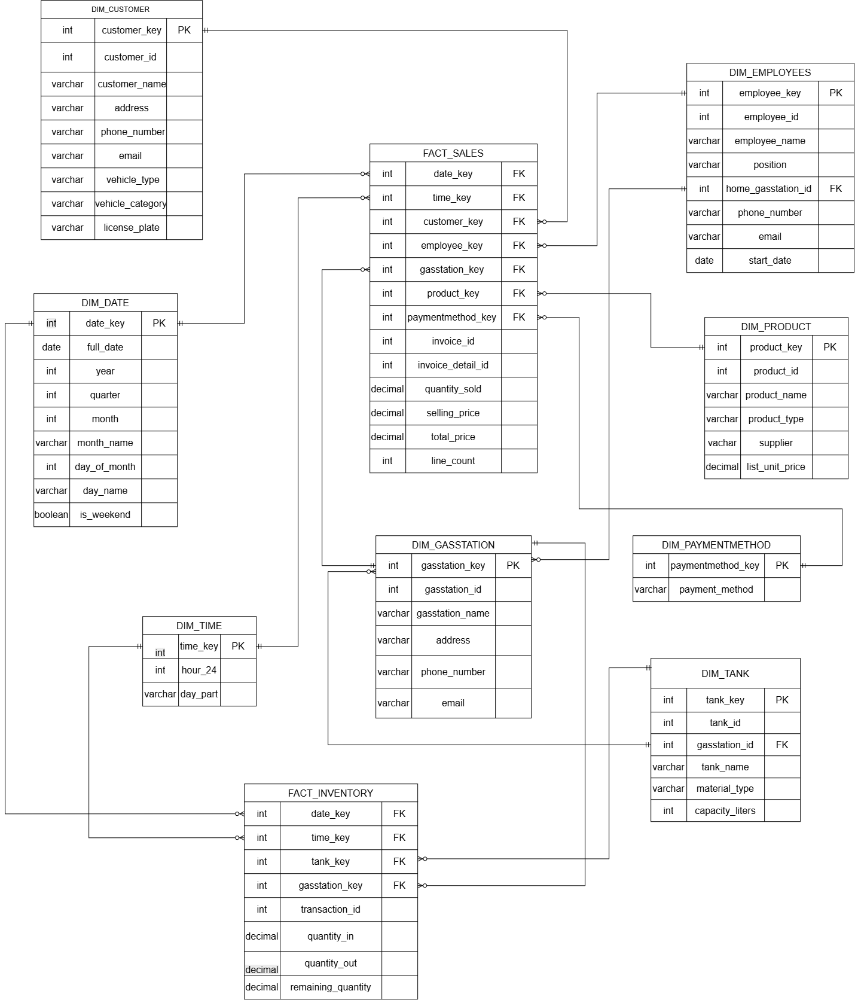

# GasStationDB - Data Warehouse & Business Intelligence Project
> **Repository:** Gasstation_KRK  
> **Group:** Project Group 1

โครงงานออกแบบและพัฒนาคลังข้อมูล (Data Warehouse) จากระบบ OLTP สู่ OLAP สำหรับธุรกิจปั๊มน้ำมัน (GasStationDB) เพื่อตอบคำถามทางธุรกิจและสร้าง Interactive Dashboard

---

## สมาชิกในกลุ่ม 

| รหัสนักศึกษา | ชื่อ-นามสกุล | บทบาทหน้าที่ |
| :---: | :--- | :--- |
| 673020045-9 | นายประภากร มีใส | |
| 673020244-3 | นายกิตติพัศ ลาล้ำ |  |
| 673020256-6 | นางสาวปภาวดี เหมาะดี |  |
| 673020264-7 | นางสาวสุกัญญา อุดมกัน |  |
| 673020266-3 | นางสาวสุพิชญา ผ่องสนาม |  |
| 673020270-2 | นางสาวอาทิติญา ชาชัย |  |

---

## 1.Operational Database (OLTP)

* **ชุดข้อมูลต้นทาง:** GasStationDB (HCM City - PostgreSQL) จาก Kaggle
* **บริบทของระบบ:** ระบบบันทึกธุรกรรมการขายน้ำมันประจำวัน การจัดการคลังน้ำมัน หัวจ่าย พนักงาน และลูกค้า
* **ER Diagram ต้นทาง:**
* [คลิกที่นี่เพื่อเปิดดู ER Diagram บน Google Drive](https://drive.google.com/file/d/1JGIX7BkISNF0DNA6mARoEywLSQCLhmJH/view)


---

## 2. กระบวนการ ELT

โครงสร้างโปรเจกต์ทั้งหมด

```
Gasstation_KRK/
└── Gasstation_dw_duckdb/
    ├── dbt_project.yml
    ├── profiles.yml                    # หรืออยู่ที่ ~/.dbt/profiles.yml
    ├── dev.duckdb                      # ไฟล์ฐานข้อมูลจริง (สร้างอัตโนมัติตอนรันครั้งแรก)
    │
    ├── Datasets/                       # ไฟล์ CSV ต้นทาง 8 ไฟล์
    │   ├── Customer.csv
    │   ├── Employee.csv
    │   ├── GasStation.csv
    │   ├── Product.csv
    │   ├── Invoice.csv
    │   ├── InvoiceDetail.csv
    │   ├── StorageTank.csv
    │   └── InventoryTransaction.csv
    │
    ├── models/
    │   ├── staging/
    │   │   ├── src_gas.yml             # ประกาศ source (ชี้ไปที่ CSV)
    │   │   ├── stg_Customer.sql
    │   │   ├── stg_Employee.sql
    │   │   ├── stg_GasStation.sql
    │   │   ├── stg_Product.sql
    │   │   ├── stg_Invoice.sql
    │   │   ├── stg_InvoiceDetail.sql
    │   │   ├── stg_StorageTank.sql
    │   │   └── stg_InventoryTransaction.sql
    │   │
    │   └── datawarehouse/
    │       ├── schema.yml
    │       ├── dim_date.sql
    │       ├── dim_time.sql
    │       ├── dim_customer.sql
    │       ├── dim_employee.sql
    │       ├── dim_gasstation.sql
    │       ├── dim_product.sql
    │       ├── dim_paymentmethod.sql
    │       ├── dim_tank.sql
    │       ├── fact_sales.sql
    │       └── fact_inventory.sql
    │
    ├── app.py                          # Streamlit: Database Inspector (dev tool)
    └── dashboard_app.py                # Streamlit: Executive Dashboard (ตอบ 15 คำถามธุรกิจ)
```
---

## 3.Business Questions (15 ข้อ)

### ด้านยอดขายและรายได้ (`invoice`, `invoicedetail`)

1. รายได้รวม (`totalamount`) แยกตามสาขา (`gasstationid`) ในแต่ละเดือนเป็นเท่าไหร่?

2. สินค้า/น้ำมันชนิดใด (`productid`) ขายดีที่สุดเมื่อวัดจาก `quantitysold` และ `totalprice`?

3. ช่องทางการชำระเงิน (`paymentmethod`) แบบไหนที่ลูกค้าใช้มากที่สุด และสัดส่วนเป็นอย่างไร?

4. ใบแจ้งหนี้เฉลี่ยต่อบิล (`totalamount` เฉลี่ยต่อ `invoiceid`) อยู่ที่เท่าไหร่ และมีแนวโน้มเพิ่ม/ลดหรือไม่?

<br>

### ด้านลูกค้า (`customer`)

5. ลูกค้ารายใดซื้อบ่อยที่สุด/มีมูลค่าซื้อสะสมสูงสุด (จาก `customerid` เชื่อมกับ `invoice`)

6. ประเภทยานพาหนะ (`vehicletypename`) แบบไหนที่มาเติมน้ำมันมากที่สุด?

7. มีลูกค้าที่ไม่ได้กลับมาซื้อซ้ำในช่วง 3-6 เดือนที่ผ่านมาจำนวนเท่าไหร่ (Customer Churn)?

<br>

### ด้านพนักงาน (`employee`)

8. พนักงานคนใด (`employeeid`) ปิดยอดขาย (`totalamount`) ได้สูงสุดในแต่ละเดือน?

9. แต่ละสาขามีจำนวนพนักงาน (`position`) เพียงพอต่อปริมาณธุรกรรม (`invoice`) หรือไม่?

<br>

### ด้านสต๊อกและถังเก็บน้ำมัน (`product`, `storagetank`, `inventorytransaction`)

10. ปริมาณน้ำมันคงเหลือ (`currentquantity`) ในแต่ละถัง (`tankid`) ใกล้ถึงจุดต่ำสุดที่ต้องสั่งเติมหรือยัง?

11. อัตราการหมุนของสต๊อก (`stockquantity` เทียบกับ `quantitysold`) ของสินค้าแต่ละชนิดเป็นอย่างไร?

12. ปริมาณน้ำมันเข้า (`quantityin`) vs ออก (`quantityout`) ในแต่ละถัง สอดคล้องกับยอดขายจริงหรือไม่ (ตรวจสอบการรั่วไหล/สูญหาย)?

13. ซัพพลายเออร์ (`supplier`) รายใดที่ส่งสินค้าให้บ่อยที่สุด และราคาต้นทุน (`unitprice`) เทียบกับ `sellingprice` ให้มาร์จิ้นเท่าไหร่?

<br>

### ด้านสาขา/ภาพรวมธุรกิจ (`gasstation`)

14. สาขา (`gasstationid`) ใดทำรายได้สูงสุด/ต่ำสุด เมื่อเทียบกันในแต่ละช่วงเวลา?

15. ความจุถังเก็บ (`capacity`) ของแต่ละสาขาเพียงพอต่อยอดขายเฉลี่ยต่อวันหรือไม่ (วิเคราะห์ความเสี่ยงน้ำมันหมด)?

---

## 4. Data Cube Diagram
* [คลิกที่นี่เพื่อเปิดดู ER Diagram บน Google Drive](https://drive.google.com/file/d/1p_veBgEP3hKBFL9z522rmi3cKWPJ4uxq/view?usp=sharing)



## Interactive Web Application & Analytics Dashboard

โปรเจกต์นี้ได้รับการพัฒนาและเปิดให้เข้าใช้งานผ่าน Streamlit Web Application ที่รวมทั้งระบบตรวจเช็กคลังข้อมูล (DW Inspector) และแดชบอร์ดวิเคราะห์ธุรกิจ (Executive Analytics) ไว้ในระบบเดียว:

* **Live Demo Web Application:** [เข้าใช้งาน GasStation Enterprise DW & Analytics Studio](https://animated-tribble-r774jrjv4xgjcg6j-8501.app.github.dev/)

---

### โครงสร้างฟังก์ชันการทำงานบน Web Application

| โมดูล / แท็บ (Tab) | วัตถุประสงค์ (Business Purpose) |
| :--- | :--- |
| **1. DW Table Inspector** | ตรวจสอบข้อมูลดิบ โครงสร้างเมตาเดตา (Schema Metadata) และทดสอบรัน SQL Console บน DuckDB |
| **2. Sales & Revenue Analytics** | สรุปรายงานวิเคราะห์ยอดขายและรายได้สถิติประจำสาขา ชนิดน้ำมัน และช่วงเวลา (Q1 - Q5) |
| **3. Inventory Operations** | ติดตามระดับน้ำมันคงเหลือในถัง อัตราเติมเข้า (Inflow) และจ่ายออก (Outflow) (Q6 - Q10) |
| **4. Staff & Customer Intelligence** | ประเมินยอดขายตามรายชื่อพนักงาน และพฤติกรรมกลุ่มลูกค้ายานพาหนะ (Q11 - Q15) |
| **5. Ad-Hoc OLAP Explorer** | เครื่องมือ Slice-and-Dice วิเคราะห์มิติข้อมูลอิสระ (Custom Dimensions) ตามต้องการ |

---

### คำสั่งสำหรับรันระบบบน Local / GitHub Codespaces

```bash
# 1. ติดตั้ง Dependencies ทั้งหมด
pip install -r requirements.txt

# 2. รันระบบ dbt สำหรับประมวลผลคลังข้อมูล
cd Gasstation_dw_duckdb
dbt run
cd ..

# 3. สั่งรัน Web Application หลัก
streamlit run app.py --server.fileWatcherType=none
